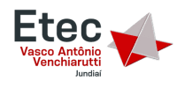

  

  <strong>Grupo Acadêmico • INFONET • ETECVAV</strong> 
  Repositório destinado ao armazenamento de atividades, projetos e trabalhos desenvolvidos durante o curso Técnico em Informática para Internet.

  

  

  

  

---

  
# 👥 Integrantes

| Integrante | Função |
|:-----------|:------:|
| 🧑🏻 Anthony Muraro | 💻 Desenvolvimento |
| 👱🏻 Calebe Barros Ramalho da Silva | 📂 Organização |
| 🧢 Daniel Teixeira Vitoriano | 🔎 Pesquisa |
| 🍰 Kelven Chetz Man Gallippi | 📝 Documentação |

---

  
# 🏫 Instituição

**ETEC Vasco Antônio Venchiarutti (ETECVAV)**

📍 Curso Técnico em **Informática para Internet (INFONET)**

---

# 📚 Disciplinas

| Sigla | Disciplina |
|:----:|:------------|
| 🌐 IW | Interface Web |
| 🗄️ BD | Banco de Dados |
| 🎨 AD | Arte Digital |
| 💡 PA | Programação e Algoritmos |
| 📁 PTIC | Projetos de Tecnologia da Informação e Comunicação |

---

# 🚀 Repositórios

| Repositório | Descrição |
|:-----------:|:----------|
| 📂 **ETECVAV-AULAS-1D** | Todas as atividades e projetos desenvolvidos durante o curso. |
| 🛠️ **Ferramentas** | Documentação das tecnologias utilizadas pelo grupo. |

---

# 📬 Contato

📧 **E-mail:** `aleatorizando29@gmail.com`

---

  

  <i>"Aprender, desenvolver e compartilhar conhecimento."</i>

